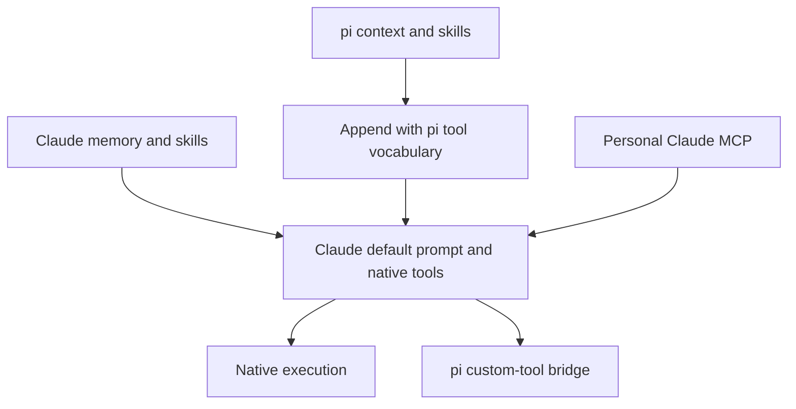
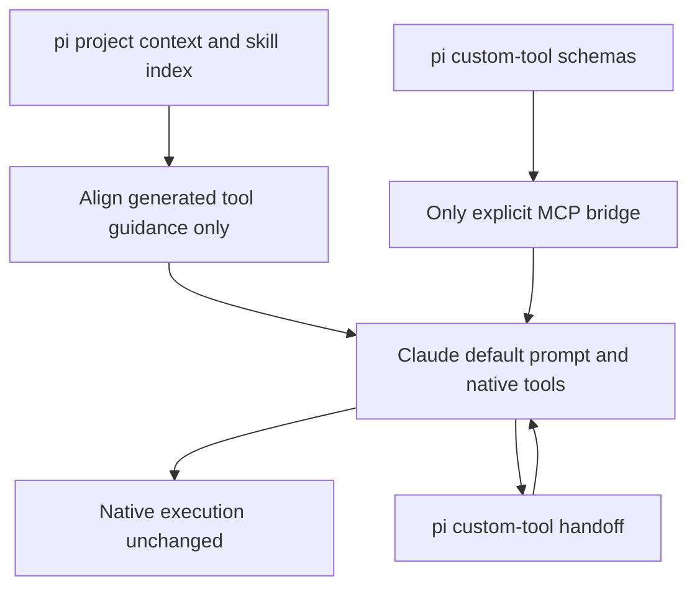

# Pi context, native Claude tools

`PI_CLAUDE_CLI_CONTEXT=pi` (0.7.1+) is an opt-in **context-loading policy**,
not a new execution mode. It retains Claude Code's default prompt, native
Read/Edit/Bash/etc., native agents, subscription authentication, and persistent
process. Custom tools still execute in pi through the existing MCP handoff.

## One owner for each layer

| Layer                                         | Owner under this policy                                                                                   |
| --------------------------------------------- | --------------------------------------------------------------------------------------------------------- |
| Base operating prompt and native tool schemas | Claude Code, unchanged                                                                                    |
| Project instructions and skill index          | pi, loaded once before calling the provider                                                               |
| Artifact and other custom-tool guidance       | pi, preserved                                                                                             |
| Generated core tool vocabulary                | Provider aligns pi names with native schemas                                                              |
| Custom integrations                           | Only pi's explicit MCP bridge; no personal Claude MCP/claude.ai connectors                                |
| Explicit host guards and managed policy       | Still honored; not disabled                                                                               |
| Conversation state and compaction             | Still two ledgers. The CLI owns compaction; a host should switch pi's off (README, "Auto-compact window") |





## Host contract

The policy requires **Claude Code 2.1.263+**, the tested isolation-control
baseline. Older or unparseable versions are rejected before a model process
starts; legacy mode retains its previous compatibility.

- **Do not pass pi `--no-context-files`.** pi must supply the project context
  before the provider disables Claude's independent loader. This also keeps
  context available when a session switches to a native pi provider.
- Leave `PI_CLAUDE_CLI_SYSTEM_PROMPT` at `claude` (default). Combining this
  policy with prompt replacement is rejected, not silently normalized.
- The provider passes `--strict-mcp-config --setting-sources ""`,
  `--disable-slash-commands`, and `--no-chrome`. It sets
  `CLAUDE_CODE_DISABLE_CLAUDE_MDS=1`, `CLAUDE_CODE_DISABLE_AUTO_MEMORY=1`, and
  `ENABLE_CLAUDEAI_MCP_SERVERS=false` on the child only.
- `PI_CLAUDE_CLI_SETTINGS` remains available for explicit host hooks and
  permissions. There is deliberately no blanket `disableAllHooks` setting:
  that could disable the host's own safety guards. Managed policy still applies.
- Do not combine with `--bare`/`CLAUDE_CODE_SIMPLE`: bare skips subscription
  OAuth/keychain authentication. An inherited simple or safe mode is rejected
  because its authentication/MCP behavior conflicts with this policy.
- Set the policy on the pi process, not globally in the user's Claude settings.
  Other pi providers ignore it. This does not alter standalone Claude Code.

The alignment changes only the recognized, generated pi preamble. Native
file/edit descriptions are schema-appropriate; pi-only multi-edit instructions
are removed there. That removal keys on `edits[]` — pi's edit signature, which
native Edit does not have — so it holds whatever wording pi ships. Matching a
list of known phrasings instead let pi 0.85.1's "Keep edits[].oldText as small
as possible…" through to live sessions. Search tools are not assumed: some
CLI/model inventories omit Grep/Glob, so guidance uses native search tools only
when advertised and Bash otherwise. Custom-tool descriptions and artifact
guidelines remain.
User directives, project-file contents, skill indexes, and `.pi` paths in the
suffix are preserved byte-for-byte. A vocabulary binding explains how names
inside those unchanged instructions map to the actual tools. Unknown/custom
prompt formats are preserved, not rewritten speculatively.

The provider does **not** independently load AGENTS.md or append a
history-dependent tool-results paragraph under this policy. Standalone legacy
behavior remains available with the variable unset or set to `legacy`.

## Existing sessions

Start a **fresh pi session** when changing policies. A saved prompt marker
identifies the policy, and mismatched/missing saved prompts are refused before
resuming the old Claude transcript. This avoids silently mixing a newly
cleaned prompt with old CLI memory. No old session is deleted or migrated.
Same-policy follow-ups keep the warm process and the saved prompt bytes.

This is not complete pi execution ownership, an OS sandbox, or a guarantee of
identical coding quality. Native agents and native tools remain native; pi
extension vetoes do not automatically apply to them. Claude's default prompt,
internal runtime, service policies, and its own compaction remain.

## Verification

```sh
npm run typecheck
npm run lint
npm run test:coverage
PI_CLAUDE_CLI_CONTEXT_LIVE=1 npx vitest run tests/live-context-policy.test.ts
```

The opt-in live test spends real subscription tokens in a disposable workspace.
It verifies native Read, a pi skill, a real custom-tool handoff, explicit host
hook execution, absence of foreign project hooks/MCP, no native skill index,
absence of foreign memory/skill sentinels in the saved CLI transcript, and one
process across two turns. It does not touch user integrations or settings.

Validated on Claude Code **2.1.263**, Haiku 4.5: 1 pi project block, 1 pi skill
index, 0 native skills, only `custom-tools` as an MCP server, 1 process.
The final fixture's appended prompt was 1,537 characters; input context was
38,948 then 39,124 tokens (38,938 cache-read on the follow-up). These are fixture
measurements, **not a before/after savings benchmark or the full system prompt**.
